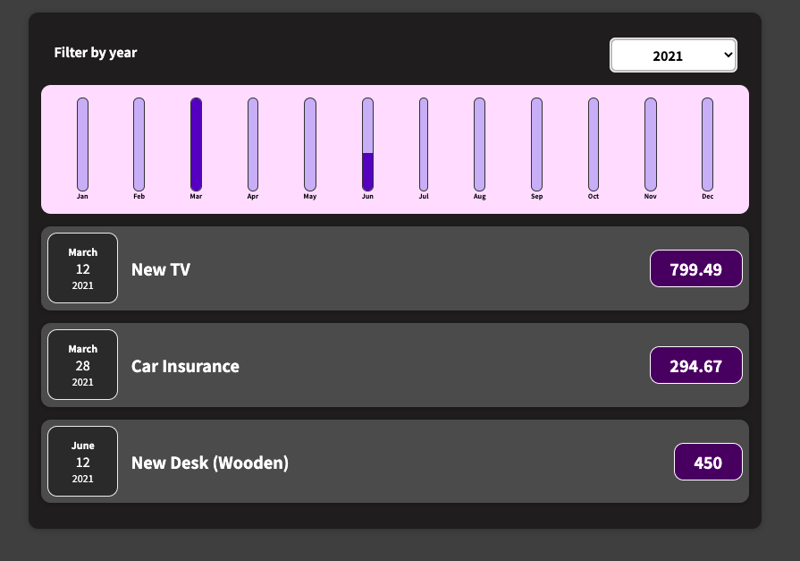
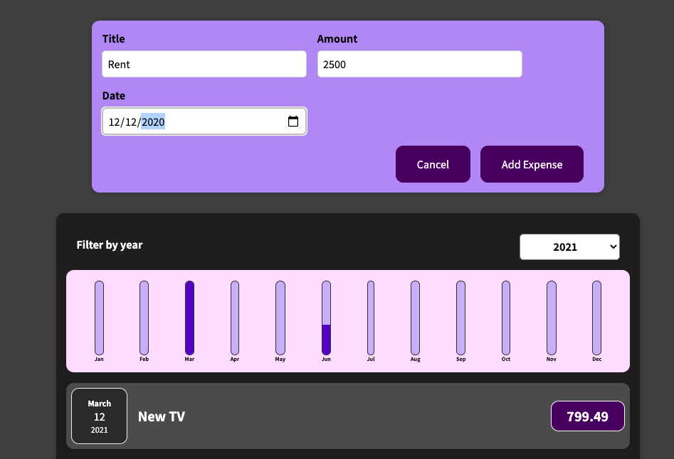

# Expense Chart

This is a React-based application designed to track and visualize expenses over the course of a year. The application is user-friendly, allowing you to manage your finances effectively by adding, filtering, and viewing expenses.

## Key Features:
*Yearly Expense Filtering*: Users can filter expenses by selecting a specific year. The application dynamically updates to display only expenses for the chosen year.

*Interactive Bar Chart*: A visually appealing bar chart shows the distribution of expenses across the months of the selected year. The height of the bars corresponds to the expense amount for that month.

*Expense List View*: Below the chart, a detailed list of all expenses for the selected year is displayed, including:

*Date*: When the expense occurred.
*Title*: A short description of the expense.
*Amount*: The monetary value of the expense.
*Add New Expenses*: Users can add new expenses via a form that collects the following inputs:

*Title*: A brief name or description of the expense.
*Amount*: The expense amount in currency.
*Date*: The date of the expense.

